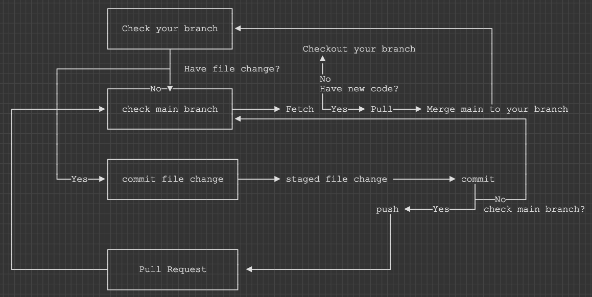

# Playwright with TypeScript Setup Guide

This guide explains how to set up **Playwright with TypeScript** from scratch.  
It includes complete step-by-step instructions for **Windows** and **macOS**.

## ✅ Requirements
- Node.js **latest 20.x, 22.x or 24.x.** (recommended: latest LTS, e.g.)
- npm (comes with Node.js)
- Code editor (Visual Studio Code recommended)
- Windows 10+, Windows Server 2016+ or Windows Subsystem for Linux (WSL).
- macOS 14 (Ventura) or later.

### 1. Install Node.js
1. Visit [Node.js official website](https://nodejs.org/).
2. Download the **LTS** version (18.x or 20.x recommended).
3. Run the installer and **select "Add to PATH"**.  
4. Verify installation:
```sh
node -v
npm -v
```
FOR 🍎 macOS, you can use Homebrew to install Node.js

### 2. Extension VS Code
1. Playwright Test for VSCode
2. Playwright Snippets
3. Playwright Test Snippets

### 3. Install Playwright

```sh
npm init playwright@latest
```

When prompted, choose / confirm:
1. TypeScript or JavaScript : Select TypeScript
2. Tests folder name : Input 'tests'
3. Add a GitHub Actions workflow (recommended for CI) : Press Enter
4. Install Playwright browsers (default: yes) : yes

### 4. Running Tests
1. Command line
```sh
# run in headless mode by default, meaning no browser window opens while running the tests.

npx playwright test

# Playwright interacts with the website.

npx playwright test --headed
```
2. Use Playwright Extension
- Open your Visual Studio Code
- Go to Extensions menu 
- Search [Playwright Test for VSCode](https://marketplace.visualstudio.com/items?itemName=ms-playwright.playwright)
- Click Install

You can click [this](https://playwright.dev/docs/running-tests) to see more running tests

### 5. Test reports
you can open the HTML reporter with the following command.
```sh
npx playwright show-report
```

### 6. Install after clone project
1. npm install
2. npx playwright install
3. npx playwright test

### 7. Project structure
playwright-project/
│
├── tests/                  # test script 
│   ├── login/
│   │   └── login.spec.ts
│   │
│   ├── home/
│   │   └── homepage.spec.ts
│   │
│   └── checkout/
│       └── checkout.spec.ts
│
├── page-objects/                  # Page Object Model (POM)
│   ├── login.ts
│   ├── dashboard.ts
│   └── checkout.ts
│
├── fixtures/               # test fixtures / helper setup
│   └── test-fixtures.ts
│
├── utils/                  # function reusable such as random, wait, api helper
│   ├── env.ts
│   ├── data-generator.ts
│   └── api.ts
│
├── test-data/              # data for test (JSON, CSV)
│   ├── users.json
│   └── products.json
│
├── playwright.config.ts    # config 
│
├── .env                    # เก็บ secrets (ไม่ commit)
│
├── .gitignore
│
├── package.json
├── yarn.lock / package-lock.json
│
├── playwright-report/      # report (auto gen)
├── test-results/           # output (auto gen)
│
└── README.md               # How to run for team


# 🧪 Writing Your First Test
Once Playwright and TypeScript are installed and configured, you can create your first test.

## Create Test
1. Always import @playwright/test at the top of your test file.

```js
import { test, expect } from '@playwright/test';
```
- test → defines a test case.
- expect → provides assertions (e.g., check title, URL, element visibility).

2. Patterns test case
```js
test(“Your test’s name”, async({page}) => {...})
```

3. Patterns test step in {...}
- For Actions (click, fill, check)
```ts
// Pattern:
await page.locator(<target>).<action>();

// Examples:
// Click locator
await page.locator(<target>).click();

//Input <Text> in locator
await page.locator(<target>).fill(<Text>)
```

